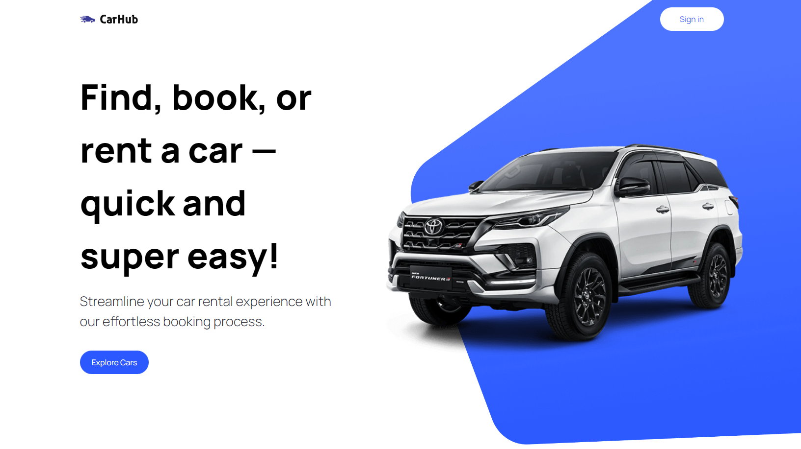

    <h2>⚜️ C A R &nbsp; H U B ⚜️</h2>

    <a href="#-project">Project</a>&nbsp;&nbsp;&nbsp;|&nbsp;&nbsp;&nbsp;
    <a href="#-technologies">Technologies</a>&nbsp;&nbsp;&nbsp;|&nbsp;&nbsp;&nbsp;
    <a href="#-features">Features</a>

 

<h3 align="center">
    
     
    <h3 align="center">
        <strong>
            <code>&nbsp;<a href="https://next-car-showcase.vercel.app">live demo</a>&nbsp;</code>
        </strong>
    </h3>
</h3>

 

## 📚 Project

Project developed with the objective of simulating a car showcase. In addition to featuring hundreds of models, this showcase also presents relevant information about them.

Project based on the video by <a href="https://www.youtube.com/watch?v=pUNSHPyVryU">JavaScript Mastery</a>.

 

## 🖥 Technologies

- [React](https://react.dev/)
- [Next.Js](https://nextjs.org/)
- [TypeScript](https://www.typescriptlang.org/)
- [Tailwindcss](https://tailwindcss.com/)

 

## 🧾 Features

- [x] Hundreds of models.
- [x] Relevant information about car models.
- [x] Filters for searching.
